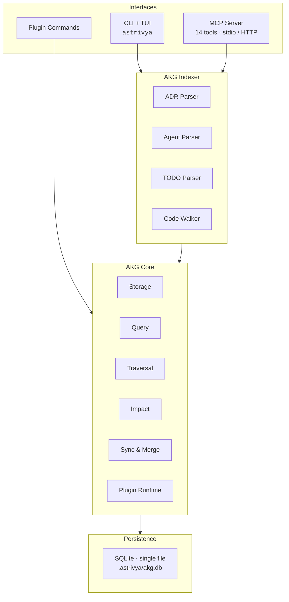

# Astrivya

**A local-first knowledge graph for AI coding agents.**

Astrivya gives your AI coding agent persistent, queryable memory that lives
in your project's `.astrivya/` directory — as a single SQLite file. No server
to run, no API keys to configure, no cloud dependency. It works offline, and
it works with Claude, Cursor, Cline, OpenCode, Codex, and any MCP-compatible
client.

[](https://github.com/astrivya/astrivya)
[](LICENSE)
[](https://github.com/astrivya/astrivya/actions/workflows/ci.yml)
[](https://www.npmjs.com/package/@astrivya/akg-core)
[](https://github.com/astrivya/astrivya)
[](https://github.com/astrivya/astrivya/graphs/contributors)

---

## Why Astrivya?

AI coding agents forget between sessions. Every new conversation starts from
scratch — no memory of your architecture decisions, your conventions, or the
reasoning behind yesterday's refactor.

Astrivya fixes that with a **knowledge graph that lives inside your repo**:

- **Single-file storage** — everything lives in `.astrivya/akg.db`. Commit it
  to git, and your agent's memory ships with your codebase. The core engine has
  exactly two runtime dependencies (`sql.js` + `env-paths`).
- **Hybrid retrieval** — keyword, vector-semantic, and graph search fused by
  intent. Ask "how does auth work?" and get code chunks, ADRs, and the
  relationships between them — not just a text match.
- **Graph reasoning** — shortest paths, topological sort, transitive
  dependencies, cycle detection, and impact analysis. Astrivya doesn't just
  store facts; it reasons over the *relationships between code and decisions*.
- **MCP native** — a 14-tool MCP server plugs into any MCP-compatible client
  over stdio or HTTP.
- **Apache 2.0** — free to use, modify, and commercialize.

### How it compares

| | Astrivya | Vector Database |
|---|---|---|
| Storage | Single file, in your repo | Hosted or external database |
| Offline / zero-infra | ✅ Yes | Usually no |
| Relations between facts | ✅ Real graph (nodes + edges) | ❌ Flat chunks |
| Impact / dependency analysis | ✅ Built-in | ❌ |
| Agent integration | ✅ MCP + CLI + plugin API | SDK only |

## Quick Start

### 1 · Install the CLI

```sh
npm install -g @astrivya/cli
```

### 2 · Initialize your project

```sh
cd my-project
astrivya init
```

A guided wizard walks you through indexing your ADRs, agent logs, and TODOs
into a local knowledge graph (`.astrivya/akg.db`), running a health check, and
launching the visual dashboard.

### 3 · Ask questions in plain English

```sh
astrivya akg query "how does authentication work?"
```

Or open the interactive TUI:

```sh
astrivya
```

### 4 · Connect your AI agent (optional)

Add the MCP server to any MCP-compatible client — see
[Use it with your AI agent](#use-it-with-your-ai-agent).

## Use it with your AI agent

Configure the MCP server in any MCP-compatible client:

```json
{
  "mcpServers": {
    "astrivya": {
      "command": "npx",
      "args": ["-y", "@astrivya/mcp-server"]
    }
  }
}
```

Your agent gains **14 tools** — search memories, log decisions, trace a
decision through the graph, find related knowledge, get daily briefings, and
more — plus 4 `astrivya://` resources.

- [Claude Code](docs/claude-code.md)
- [Cursor](docs/cursor.md)
- [OpenCode](docs/opencode.md)
- [Codex CLI](docs/codex-cli.md)

## Features

| | Feature | What you get |
|---|---|---|
|  | **Local storage** | Single-file SQLite in `.astrivya/akg.db`. No server, no API keys — commit it and your memory ships with the repo |
|  | **Hybrid search** | Keyword + semantic + graph retrieval, fused by intent — not just text matching |
|  | **Graph reasoning** | Shortest paths, topological sort, and transitive dependencies over real nodes and edges |
|  | **Impact analysis** | See what a change breaks before you make it, with risk scoring and cycle detection |
|  | **Auto-indexing** | Parses ADRs, agent activity logs, and TODOs into the graph automatically |
|  | **Sync & merge** | Last-write-wins merge with conflict counting for multi-device sync |
|  | **CLI + TUI** | Interactive TUI and 16 commands — run `astrivya` with no arguments |
|  | **Plugin system** | Signed, verified, discoverable commands via `@astrivya/plugin-api` |

## How it works



The **core** is dependency-light and embeddable. The **indexer** turns
markdown, logs, and source files into nodes and edges. The **MCP server** and
**CLI** expose it to agents and humans. The **plugin system** extends it with
cloud and premium commands.

## Packages

| Package | npm | Size (tarball) | Role |
|---------|-----|------|------|
| [`@astrivya/akg-core`](packages/akg-core) | [](https://www.npmjs.com/package/@astrivya/akg-core) | 41 KB | Core engine: storage, query, traversal, impact, sync |
| [`@astrivya/akg-indexer`](packages/akg-indexer) | [](https://www.npmjs.com/package/@astrivya/akg-indexer) | 15 KB | Indexers: ADRs, agent logs, TODOs, embeddings |
| [`@astrivya/mcp-server`](packages/mcp-server) | [](https://www.npmjs.com/package/@astrivya/mcp-server) | 20 KB | MCP server: 14 tools, stdio + HTTP |
| [`@astrivya/cli`](packages/cli) | [](https://www.npmjs.com/package/@astrivya/cli) | 161 KB | CLI + TUI: init, index, search, manage |
| [`@astrivya/plugin-api`](packages/plugin-api) | [](https://www.npmjs.com/package/@astrivya/plugin-api) | — | Types & contracts for plugin authors |
| [`@astrivya/plugin-runtime`](packages/plugin-runtime) | [](https://www.npmjs.com/package/@astrivya/plugin-runtime) | — | Signed plugin download, verify, load |
| [`atlas`](packages/atlas) | _demo app, run from source_ | — | WebGL graph visualizer (pre-alpha) |

## CLI

Run `astrivya` with no arguments for the interactive TUI, or use any command:

```sh
astrivya init        # Initialize workspace + graph
astrivya akg status  # Show graph stats
astrivya akg impact <file>   # What breaks if I remove this?
astrivya akg trace <src> <tgt>  # Path through the graph
astrivya mcp-server   # Serve MCP over stdio
astrivya doctor       # Diagnose your setup
astrivya atlas        # Launch the WebGL visualizer
```

## Documentation

- [Quick Start](docs/QUICKSTART.md)
- [Architecture](docs/ARCHITECTURE.md)
- [API Reference (akg-core)](docs/akg-core-api.md)
- [Contributing](CONTRIBUTING.md)
- [Security](SECURITY.md)
- [Code of Conduct](CODE_OF_CONDUCT.md)
- [Changelog](CHANGELOG.md)
- MCP client setup: [Claude Code](docs/claude-code.md) · [Cursor](docs/cursor.md) · [OpenCode](docs/opencode.md) · [Codex CLI](docs/codex-cli.md)

## Contributing

Contributions are welcome! Read [CONTRIBUTING.md](CONTRIBUTING.md) to get
started — fork, fix, and open a PR. All contributions are licensed under
Apache 2.0.

## Community

- [GitHub Issues](https://github.com/astrivya/astrivya/issues) — bugs, features, questions
- [Discussions](https://github.com/astrivya/astrivya/discussions) — ideas, help, showcase
- [Twitter/X](https://x.com/astrivya) — updates and announcements

## License

[Apache 2.0](LICENSE) © Astrivya

<a href="#">▲ Back to top</a>
